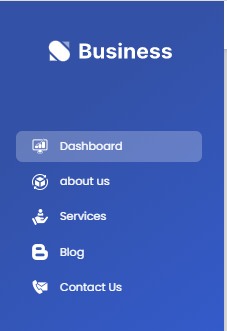
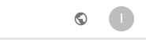

# Business

### The project can be run locally:-
#### 1- open the terminal
#### 2- git clone the repository
#### 3- cd business
#### 4- npm i
#### 5- open .env file and add postgressql Database link
#### 6- npm run buildDB (to build the database)
#### 7- npm run dev
#### 5- open another  the terminal
#### 6- cd client
#### 7-  npm i
#### 8- npm start (port=3000)

### Site sections:-

* You can move between sections via the navbar
* You can enter the control panel by clicking on the Dashboard
* Login data:( email: admin@admin ,password: admin123)

* You can move between sections via Menu Side
* You can enter each section and see the information of the section and add, delete and modify it

* You can change the language by clicking on the language icon

### Build with:-
* React js
* express js 
* postgressql
* sequelize
* material UI
* i18next

